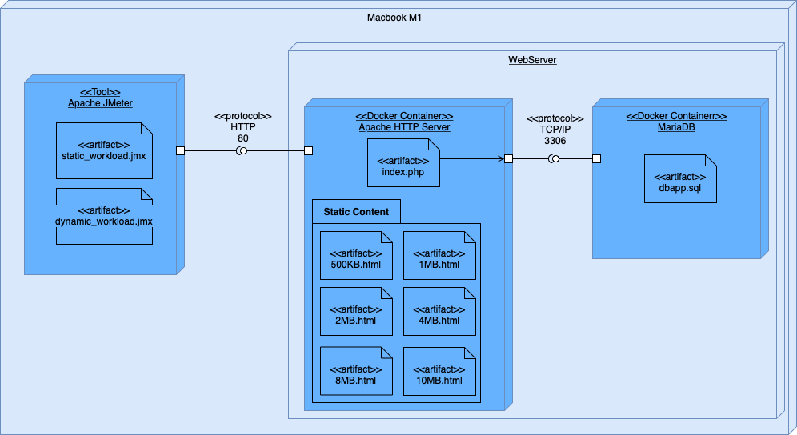

# What A Capacity Test?
Let's create website's capacity test

## Abstract
*What is a capacity test?*

Capacity test is a **testing measure** that evaluates the speed, responsiveness and stability of a computer, network, software program or device under a workload. Organizations will run those tests in order to **identify performance-related bottlenecks**.

More generally, performance analysis refers to characterizing performance under several working conditions.

Performance analysis can be characterized by several indicators, in this work a web server will be studied using those indicators:

- *Response Rate (Throughput)*
- *Latency*
- *Requests Failed*

## Description

In this work a capacity test, on Apache WebServer connected with a MySQL DataBase, will be runned in following steps:

1. Create a **System Design Architecture** based on container technology, those container will be runned using limited resources to elaborate differents tests

2. Define a proper **experimental design** to run out using common techniques in State of Art

3. Collect several **observations** (repetitions) for each value of design

4. Perform a performance analysis to determine a proper system configuration using **allocation of variation** and **ANOVA** techniques

5. Perform a capacity test to determinate **knee** and the **usable** capacity point of work of system defined in previuos step

## System Design 

All tests will be runned on MacBook Air 2020 using those specs:

- CPU: Apple M1 (Arm 64-bit)
- RAM: 8GB

Docker will run on this specs:

- Docker cores: 4
- Docker RAM: 4 GB
- Swap memory (for each container): 256MB

WebServer is built on simple **2-tier architecture**, using 2 different **Docker container** described using this deployment diagram:

Tested environment has different components, which include artefacts and interfaces in order to comunicate each other.

### Apache HTTP Server 

Apache HTTP Server is a docker container with prebuilded image, that contains Apache WebServer configured with php module, in listening on port 80. Futhermore, MySQL connector is installed to communicate with MariaDB component.

There are differents files uploaded in container, those artefacts are usefull to create 3 type of different workload:

- **Static Workload**: include only html static pages to download
- **Dynamic Workload**: static and dynamic pages are generated using operation on database

### MariaDB Server

MariaDB Server is a docker continer with prebuilded image with preconfigured MySQL service in listening on port 3306.

`dbapp.sql` file is preloaded in `/docker-entrypoint-initdb.d` path to init e populate database.

### Apache JMeter

Clients are simulated using a load tester: **Apache JMeter** is an application designed to **measure performance** and **load test** applications.

For each workload a JMeter test will be replicated more times in order to collect data for case study.

## Experimental Design

An experiment is a test in which changes are made to the input variables of a system or process with the aim of **observing and identifying the reasons of changes in the output**.

Some of contrallable input are identified to study the response:

- Apache HTTP Server CPU
- Apache HTTP Server RAM
- MariaDB Server CPU
- MariaDB Server RAM
- Workload

For each factor a minimun and maximum level will be evaluated:

| Level | 1 | 2 |
| :-: | :-: | :-: |
| **Apache CPU** | 0.125 vCPU | 0.5 vCPU |
| **MariaDB CPU** | 0.125 vCPU | 0.5 vCPU |
| **Apache RAM** | 256 MB | 1 GB |
| **MariaDB RAM** | 256 MB | 1 GB |
| **Workload** | Static | Dynamic |

A full factor design $2^5*5$ would require a total of 160 experiments, in order to reduce number of expirements a fractional factor design $2^{5-2}*5$ will be placed on with a total of 40 expirements. 

## Data collection

In order to collect usefull data, containing knee and usable capacity point of work, it is needed to stress system untils its usable point.

So preliminar tests will be conducted, on highest level of each parameter, to individuate a test configuration that led to system errors.