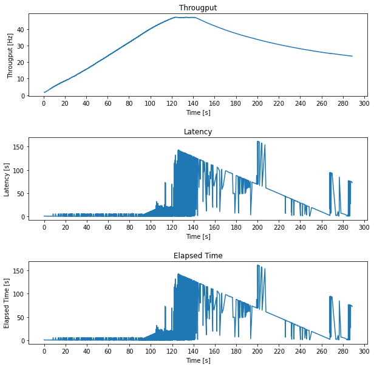

# What A Capacity Test?
Let's create website's capacity test

## Instruction

Run test webserver:

```bash
make test
```

Run all experiment with 100 tests for each configuration:
```bash
make all END=100
```

Run all experiment with 5 tests for each configuration:
```bash
make all_5
```

Run single experiment once on single configuration:
```bash
END=1
experiment0
```

## Abstract
*What is a capacity test?*

Capacity test is a **testing measure** that evaluates the speed, responsiveness and stability of a computer, network, software program or device under a workload. Organizations will run those tests in order to **identify performance-related bottlenecks**.

More generally, performance analysis refers to characterizing performance under several working conditions.

Performance analysis can be characterized by several indicators, in this work a web server will be studied using those indicators:

- *Response Rate (Throughput)*
- *Elapsed Time*
- *Latency*
- *Requests Failed*

## Description

A capacity test, on Apache WebServer connected with a MySQL database, will be runned in following steps:

1. Create a **System Design Architecture** based on container technology, those container will be runned using limited resources to elaborate differents tests

2. Define a proper **experimental design** to run out using common techniques in State of Art

3. Collect several **observations** (repetitions) for each value of design

4. Perform a performance analysis to determine a proper system configuration using **allocation of variation** and **ANOVA** techniques

5. Perform a capacity test to determinate **knee** and the **usable** capacity point of work of system defined in previuos step

## System Design 

All tests will be runned on MacBook Air 2020 using those specs:

- CPU: Apple M1 (Arm 64-bit)
- RAM: 8GB

Docker will run on this specs:

- Docker cores: 4
- Docker RAM: 4 GB

WebServer is built on simple **2-tier architecture**, using 2 different **Docker container** described using this deployment diagram:


Tested environment has different components, which include artefacts and interfaces in order to comunicate each other.

### Apache HTTP Server 

Apache HTTP Server is a docker container with prebuilded image, that contains Apache WebServer configured with php module, in listening on port 80. Futhermore, MySQL connector is installed to communicate with MariaDB component.

There are differents files uploaded in container, those artefacts are usefull to create 2 type of different workload:

- **Static Workload**: include only html static pages to download
- **Dynamic Workload**: dynamic pages are generated using operations on database

### MariaDB Server

MariaDB Server is a docker continer with prebuilded image with preconfigured MySQL service in listening on port 3306.

`dbapp.sql` file is preloaded in `/docker-entrypoint-initdb.d` path to init e populate database.

### Apache JMeter

Clients are simulated using a load tester: **Apache JMeter** is an application designed to **measure performance** and **load test** applications.

For each workload a JMeter test will be replicated more times in order to collect data for case study.

## Experimental Design

An experiment is a test in which changes are made to the input variables of a system or process with the aim of **observing and identifying the reasons of changes in the output**.

Some of contrallable input are identified to study the response:

- Apache HTTP Server CPU
- Apache HTTP Server RAM
- MariaDB Server CPU
- MariaDB Server RAM
- Workload

For each factor a minimun and maximum level will be evaluated:

| Level | 1 | 2 |
| :-: | :-: | :-: |
| **Apache CPU** | 0.125 vCPU | 0.5 vCPU |
| **MariaDB CPU** | 0.125 vCPU | 0.5 vCPU |
| **Apache RAM** | 256 MB | 1 GB |
| **MariaDB RAM** | 256 MB | 1 GB |
| **Workload** | Static | Dynamic |

The response to be evuluted is the **mean throughput** of system.

### Fraction Factor Design

A full factor design $2^5*5$ would require a total of 160 experiments, in order to reduce number of expirements a fractional factor design $2^{5-2}*5$ will be placed on with a total of 40 expirements. 

Using following association:

| Factor | Name |
| :-: | :-: |
| **Apache CPU** | A |
| **MariaDB CPU** | B |
| **Apache RAM** | C |
| **MariaDB RAM** | D|
| **Workload** | E |

#### Effect Counfouding

A decision needs to be taken about factor counfouding, in particular designer decided to confuse:

- A = CE
- B = DE

This choices were dicted by the possible relationship between workload and memory RAM of same component.

Sign table will be generated simply using `itertools`:

```python
import itertools
import pandas as pd

C = [-1, +1]
D = [-1 , +1]
E = [-1 , +1]

Table = []

for x in itertools.product(C, D, E):
  Table.append(x)

TableSign = pd.DataFrame(Table, columns=["C", "D", "E"])
TableSign["CD"] = TableSign["C"] * TableSign["D"]
TableSign["CE"] = TableSign["C"] * TableSign["E"]
TableSign["DE"] = TableSign["D"] * TableSign["E"]
TableSign["CDE"] = TableSign["C"] * TableSign["D"] * TableSign["E"]
TableSign.to_markdown()
```

Result:

|  Experiment  |   C |   D |   E |   CD | A=CE | B=DE |   CDE |
|---:|----:|----:|----:|-----:|-----:|-----:|------:|
|  0 |  -1 |  -1 |  -1 |    1 |    1 |    1 |    -1 |
|  1 |  -1 |  -1 |   1 |    1 |   -1 |   -1 |     1 |
|  2 |  -1 |   1 |  -1 |   -1 |    1 |   -1 |     1 |
|  3 |  -1 |   1 |   1 |   -1 |   -1 |    1 |    -1 |
|  4 |   1 |  -1 |  -1 |   -1 |   -1 |    1 |     1 |
|  5 |   1 |  -1 |   1 |   -1 |    1 |   -1 |    -1 |
|  6 |   1 |   1 |  -1 |    1 |   -1 |   -1 |    -1 |
|  7 |   1 |   1 |   1 |    1 |    1 |    1 |     1 |

Algebra of confunding is usefull to obtain generator polynomial and find relationship of confusions.

$$
\begin{cases}
A = CE \\
B = DE \\
\end{cases} \implies AB= CD
$$

This relationship is usefull to find generator polynomial $I$:

$$ CD = AB$$

$$ CD \cdot D = AB \cdot D $$

$$ C = ABD $$

$$ C \cdot C = ABD \cdot C $$

$$ I = ABCD$$

Generator polynomial can be used to calculate all of confounded effects:

| Effect | Confounded 1 | Confounded 2 | Confounded 3 |
| :-: | :-: | :-: | :-: |
| **C** | AE | ABD | BCDE | 
| **D** | BE | ABC | ACDE |
| **E** | AC | BD | ABCDE |
| **CD** | AB | BCE | ADE |
| **CE** | A | BCE | ABDE |
| **DE** | B | ACD | ABCE |
| **CDE** | AD | AC | ABE |

## Data collection

In order to collect usefull data, containing **knee** and **usable** capacity point of work, it is needed to stress system untils its usable point.

### Workload Characterization

Preliminar tests will be conducted, on system configuration with highest level of each parameter, to individuate a **load test configuration** in JMeter that led to system errors. Futhermore, a particular focus is paid on JMeter exceptions, workload is tuned in order to avoid any client error.

Simulated workload will be rappresentative for a stress test on WebServer using those criterias:

- A lot of people try to connect server
- Number of user active is incremental: half of test time is used to activate all user and the other half of time is used to stress system on full load
- Each user generate a traffic with a request for each 2 seconds
- Different static pages will be loaded using a **Random Order Controller** in order to generate a static traffic considering 2MB as mean of generic HTML page size.
- Dynamic workload will be performed using a **Random Controller** in order to generate random traffic using dynamic webpages with database operations

In summary, this **workload characterization** has those parameters:

| Parameter | Value |
| :-: | :- |
| Test duration | 5 minutes |
| Virtual users | 250 threads |
| Ramp-up period | 150 seconds |
| Throughput (for user) | 30 requests/minute |
| Static Workload | Static HTTP pages sized: <br> 500KB <br> 1MB <br> 2MB <br> 4MB |
| Dynamic Workload | PHP using r/w operations on MySQL Server |

### Test Automatization

During data collection phase, automatization process can be usefull to collect data from system fastly, in `jmeter` folder there are a subfolder for each experiment, in which is created a `run_experiment.sh` script that will be used to run JMeter with proper configuration.

## Allocation of Varation and ANOVA

Visual analysis is performed as preliminary step to obtain usefull information and make hypothesis. As shown in sign table, experiments with even number are performed using static workload, instead of experiments with odd number using dynamic workload.


In static workload, after knee point the throughput is almost constant, while in dynamic workload the response decreases significantly due to MariaDB server's restart.

The response, evaluated in terms of mean throughput, will be significantly different for static workload and dynamic workload, so we will be expected to observe Workload factor as important effect.

Futhermore the knee and usable point distance in the throughput curve are different for static workload and dynamic workload, so we will be accurately choice the knee point in a different way for each workload.

### Response model

The response is defined as the mean throughput, which is the average number of requests per second, in order to evaluate importance and significance of each effect/interaction, the response needs to be modeled.

$$y_{ijkz} = \mu + \alpha_i + \beta_j + \gamma_k + \delta_{ij} + \zeta_{ik} + \eta_{jk} + \sigma_{ijk} + e_{ijkz}$$

Where:

| Variable | Description |
| :-: | :-: |
| **$\mu$** | Mean of response |
| **$\alpha_i$** | Factor C effect |
| **$\beta_j$** | Factor D effect |
| **$\gamma_k$** | Factor E effect |
| **$\delta_{ij}$** | Interaction C-D effect |
| **$\zeta_{ik}$** | Interaction C-E effect |
| **$\eta_{jk}$** | Interaction D-E effect |
| **$\sigma_{ijk}$** | Interaction C-D-E effect |
| **$e_{ijkz}$** | Sperimental error |

Using this model and some assumptions, we can obtain a linear model, which will be used to estimate the effect of each parameter.

In order to evaluate the effects of factors, we need to estimate the variance and significance of the effects. We will use the following procedure:

1. Calculate variance for each factor and interaction.
2. Individue the most important factors/interactions.
3. Validating the results by conducting an ANOVA on interearated factors.

Variance is calculated using Sum of Squares method, remembering that sum of effect, interaction and error along axis are all equal to zero, so relationship can be simplified to:

$$
\sum y^2_{ijkz} = mnpr\cdot \mu^2 + npr\sum_{i}\alpha^2 + mpr\sum_{j}\beta^2 + mnr\sum_{k}\gamma^2 + pr\sum_{i,j}\delta^2 + mr\sum_{i,k}\zeta^2 + nr\sum_{j,k}\eta^2 + r \sum_{i,j,k}\theta^2 + \sum_{i,j,k,z} e^2 
$$

$$
SST = SSO + SSC + SSD + SSE + SSCD + SSCE + SSDE + SSCDE
$$

### Allocation of Variation

Allocation of Variation of factor/interaction is calculated as follows:

$$Variation = \frac{\text{Sum of Square of factor}}{SST}$$

Recording confounded effects:

- A = CE
- B = DE

A bar chart is used to indicate the most important factor/interaction:


### ANOVA Test

In order to validate the results, we need to conduct an ANOVA test on important factors, so prelimanary we compute degrees of freedom of each factor:

$$
SST = SSO + SSC + SSD + SSE + SSCD + SSCE + SSDE + SSCDE
$$

$$
mnpr = 1 + (m-1) + (n-1) + (p-1) + (m-1)(n-1) + (m-1)(p-1) + (n-1)(p-1) + (m-1)(n-1)(p-1) + mnp(r-1)
$$

Using a 2^k factorial design, we have only one degree of freedom for each factor and interaction, so we have only one Fisher table's value to compare (remembering that degree of error $mnp(r-1) = 32$).

Using a significance level of 0.05, we can calculate F-value to compare to significance of factor/interaction, this value is 4.15.

Significance of level using ANOVA classical test is calculated as follows:

$$F = \frac{\frac{SSA}{\nu_A}}{\frac{SSE}{\nu_e}} = \frac{MSA}{MSE}$$

Where:

- $\nu_A$ : degree of freedom for factor A
- $\nu_e$ : degree of freedom for sperimental error
- $MSA$ : mean square of factor A
- $MSE$ : mean square of sperimental error

Both factors are significant, so the results are significant, and factor has a low importance biased from static workload, in which importance is almost zero.

A different investigation using 2 different experiments for each workload is needed to validate the results.

[Here](./notebooks/Performance_Analysis_Factor_Analysis.ipynb) link for complete exercise with code.

## Capacity Test

Considering previous results, capacity test will be performed on a dynamic workload's configuration. Analist decided based on the previous results, to test the configuration #3:

- Apache CPU: 0.125 vCPU (Level 1)
- Apache RAM: 256MB RAM (Level 1)
- MariaDB CPU: 0.5 vCPU (Level 2)
- MariaDB RAM: 1GB RAM (Level 2)

Performance analysis can be characterized by several indicators, in this case will be studied those indicators:

| Indicator | Description |
| --------- | ----------- |
| *Response Rate (Throughput)* | The **number of requests** per second that the application can handle. |
| *Elapsed Time* | The time it takes for the server to **handle** a request. |
| *Latency* | The time it takes for the server to **respond** to a request. |
| *Requests Failed* | The number of requests that **failed**. |



As shown in the figure, latency and elapsed have a similar behavior, that because of the nature of the workload, infact too much SQL requests led to MariaDB component to crash and recovery phase is not fast enough to handle the workload.

### Capacity Point

**Knee Capacity** is the point beyond which the response time increases rapidly as the load but the gain in throughput is small. Before the knee, the response time does not increase significantly but the throughput rises as the load increases.

**Usable Capacity** is the point of maximum throughput achievable without exceeding a prespecified response time limit.

In this case knee and usable capacity are very close, so it is a good practice to choose a smaller knee capacity to dimensionate the workload: analist decided to individuate the knee point as the point at 100 seconds of workload (about 160 virtual users online).

Usable Point is individuated when throughput stop to increase and system start to return errors due to component crash: analist decide to individuate the usable point as the point at 140 seconds of workload (about 230 virtual users online).

[Here](./notebooks/Capacity_Test_Dynamic.ipynb) link for complete exercise with code.